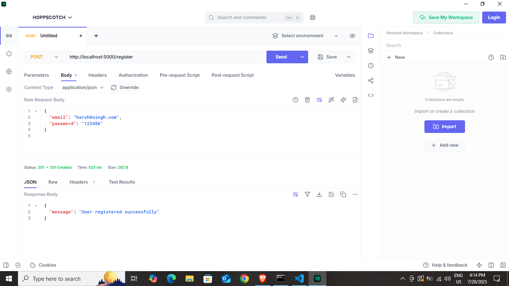
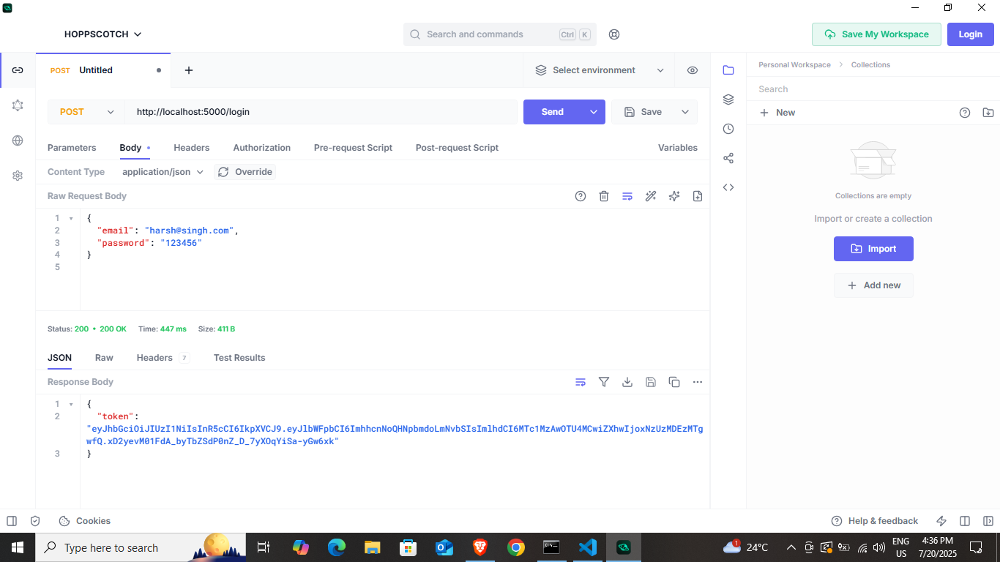
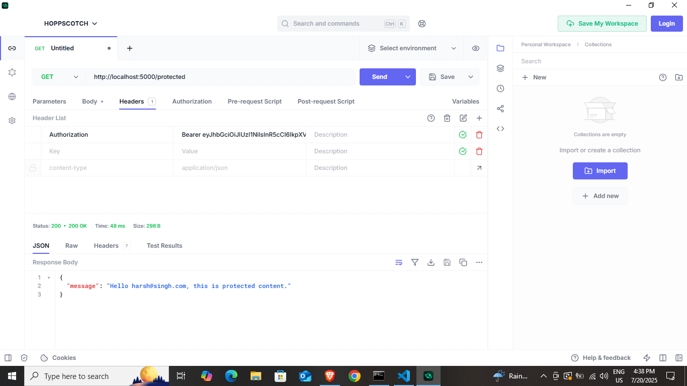

# Assignment-Week-7
# JWT Auth API (Node.js + Express)

This is a basic RESTful API with JSON Web Token (JWT) authentication.

## 📦 Features

- User Registration
- User Login with JWT
- Protected Route Access

## 🛠️ Tech Stack

- Node.js
- Express.js
- bcryptjs
- jsonwebtoken
- dotenv

---

## 🚀 Getting Started

### 1. Clone the repository
```bash
git clone https://github.com/your-username/jwt-auth-api.git
cd jwt-auth-api

---

## 🧪 API Endpoints (via Postman)

### ✅ Register

- **POST** `/register`
- **Description**: Register a new user
- **Request Body**:
```json
{
  "email": "user@example.com",
  "password": "123456"
}
```



---

### ✅ Login

- **POST** `/login`
- **Description**: Login user and get JWT token
- **Request Body**:
```json
{
  "email": "user@example.com",
  "password": "123456"
}
```
- **Response**:
```json
{
  "token": "<JWT_TOKEN>"
}
```



---

### 🔐 Protected Route

- **GET** `/protected`
- **Header**:
  - `Authorization: Bearer <JWT_TOKEN>`
- **Response**:
```json
{
  "message": "Hello user@example.com, this is protected content."
}
```



---

## 📁 Folder Structure

```
jwt-auth-api/
├── server.js                # Main server logic
├── users.js                 # In-memory user database
├── .env                     # Environment variables
├── .gitignore               # Ignored files/folders
├── README.md                # This file
└── postman-screenshots/     # Postman screenshots
    ├── register.png
    ├── login.png
    └── protected.png
```

---

## 🔒 Environment Variables

In your `.env` file:
```
PORT=5000
JWT_SECRET=your_secret_key
```

---

## 📌 Notes

- This project uses an in-memory `users.js` file — no database.
- All passwords are securely hashed using `bcryptjs`.
- Tokens expire in 1 hour for demonstration.
- Use Postman or cURL for testing.

---

## 🧑‍💻 Author

Built by [Your Name](https://github.com/h4rshgithub)  
🔗 GitHub: [github.com/h4rshgithub](https://github.com/h4rshgithub)

---

## 📄 License

This project is open-source and available under the [MIT License](LICENSE).

